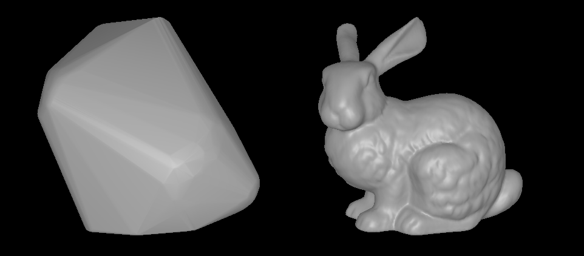

# chull
 [](https://crates.io/crates/chull)

Convex hull approximation for rust based on [Quick hull](http://citeseerx.ist.psu.edu/viewdoc/summary;jsessionid=C57E2269B0D64504B97E8469F6A1315D?doi=10.1.1.117.405).
Available in 3-D or 2-D for now.
### Examples
```rust
use chull::ConvexHull;

let p1 = vec![1.0, 1.0, 1.0];
let p2 = vec![1.0, 1.0, -1.0];
let p3 = vec![1.0, -1.0, 1.0];
let p4 = vec![1.0, -1.0, -1.0];
let p5 = vec![-1.0, 1.0, 1.0];
let p6 = vec![-1.0, 1.0, -1.0];
let p7 = vec![-1.0, -1.0, 1.0];
let p8 = vec![-1.0, -1.0, -1.0];
let p9 = vec![0.0, 0.0, 0.0];
let cube = ConvexHull::try_new(&[p1, p2, p3, p4, p5, p6, p7, p8, p9], None).unwrap();
assert_eq!(cube.volume(), 8.0);
assert_eq!(cube.area(), 24.0);
let (_v,i) = cube.vertices_indices();
assert_eq!(i.len(), 6 * 2 * 3);
```

License: MIT/Apache-2.0
